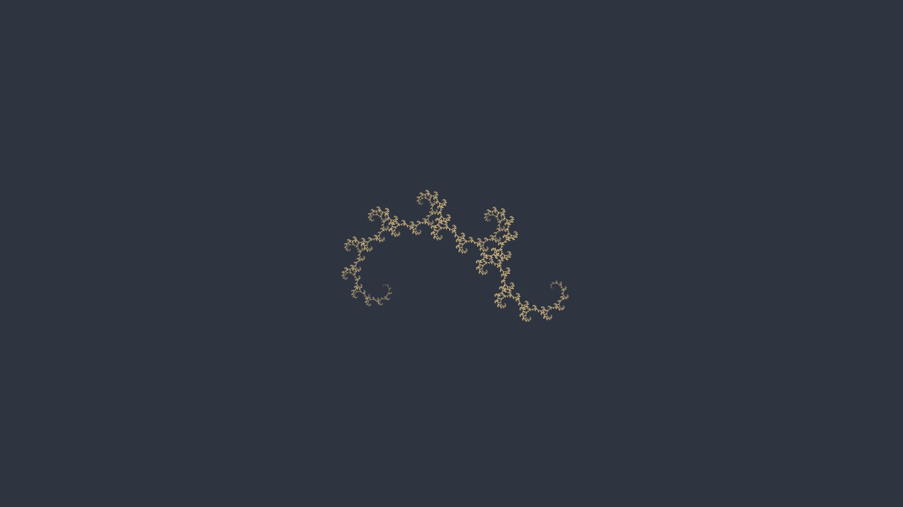

# PyFS | 2D fractal renderer using Iterated Function Systems

## Configuration
PyFS can generate aesthetically configurable renders of 2D fractals by rendering
the attractor of the corresponding Iterated Function System. For well known
fractals, the IFS is usually given on the Wikipedia page, such as for the
[Lévy C curve](https://en.wikipedia.org/wiki/L%C3%A9vy_C_curve#IFS_construction).

At the top of `render.py` under `# Configuration` several options are given for
choosing the fractal and adjusting both the calculations and the visualization.

- `COLORS_HEX` is a dict that defines the different colors used in different
  cases, given by integer keys. Currently only two keys are used, 0 for
  background and 1 for fractal color (although due to image interpolation the
  output image may also contain interpolations of these).
- `RESOLUTION` is the resolution of the output image.
- `PADDING` is the minimum padding (in distance in the plane) around the fractal
  on all sides. Since aspect ratio is maintained some sides may have extra
  padding depending on the resolution.
- `ZOOM` is the integer factor by which the resolution is increased for pixel
  placement. A `ZOOM` of more than 1 means multiple pixels get interpolated
  together in the final image, which automatically produces a fade-out effect in
  parts of the fractal with lower density.
- `ITERATIONS` is the number of times one of the functions is applied to a point
  before it is considered final. If the fractal drawing is 'spilling' into the
  surrounding space and fine details are not shown, consider increasing this. If
  calculations are taking too long consider decreasing this.
- `POINTS` is the number of points that are chosen to draw the fractal. Many of
  these points will end up in the same pixel, but if too few points are drawn
  some pixels will be missed. If the fractal is noticeably missing some pixels,
  consider increasing this number. Similarly, if calculations are taking too
  long consider decreasing it.

### Adding a custom fractal
To add a custom fractal, make a corresponding python module in `pyfs/fractals/`.
Define a function `get` that returns an `IteratedFunctionSystem`, essentially a
list of the functions from the IFS (see `pyfs/fractals/__init__.py` for an exact
type definition). Additionally you can define any helper methods and variables
required. To use it, just change `IFS_NAME` to the file name of the new fractal
(without `.py`).
